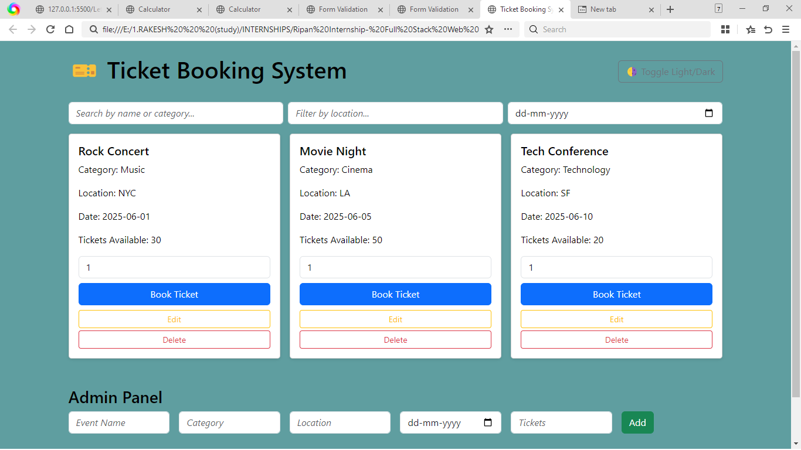
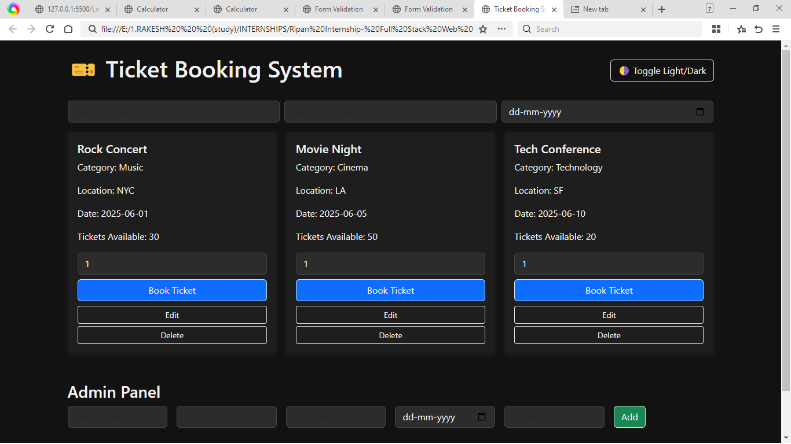
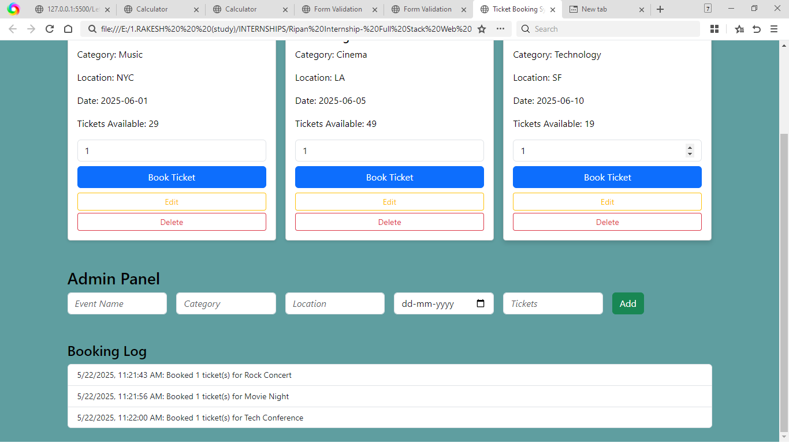

 Ticket Booking System

📝 Project Description
The **Ticket Booking System** is a responsive web application designed to streamline the process of viewing, booking, and managing event tickets. Whether it's a concert, movie, or tech conference, users can filter through events, book available tickets, and receive confirmation — all in a user-friendly interface. Admins can manage event details through a built-in dashboard.

🧑‍💻 Technologies Used
- **Frontend**: HTML, CSS, JavaScript
- **Styling**: Bootstrap 5
- **Data Handling**: LocalStorage (for persisting bookings and events)
- **Interactivity**: DOM Manipulation, Event Listeners
- **Email Notifications**: [EmailJS](https://www.emailjs.com/) (for sending booking confirmations)
- **UI Enhancement**: Responsive layout and dark mode toggle

📸 Screenshots

✅ Light Mode

🌗 Dark Mode

🛠 Admin Panel

📽 Video Demonstration
🔗 [Watch the demo](https://youtu.be/5_cCEnFo2MU)  

 Key Features

- 🗂 **Event Filtering** by name, category, location, or date
- 🧾 **Real-Time Availability Updates** per event
- 🎟️ **Ticket Booking with Simulated Payment Modal**
- 📬 **Booking Log Tracking**
- ⚙️ **Admin Panel** for Adding, Updating, and Deleting Events
- 🌙 **Light/Dark Mode Toggle**
- 📧 **Email Notifications** with EmailJS

📌 Bonus Functionalities Implemented
- [x] Filters for name, location, and date
- [x] Simulated payment modal
- [x] Dark/light mode support
- [x] Email booking confirmation (EmailJS)
